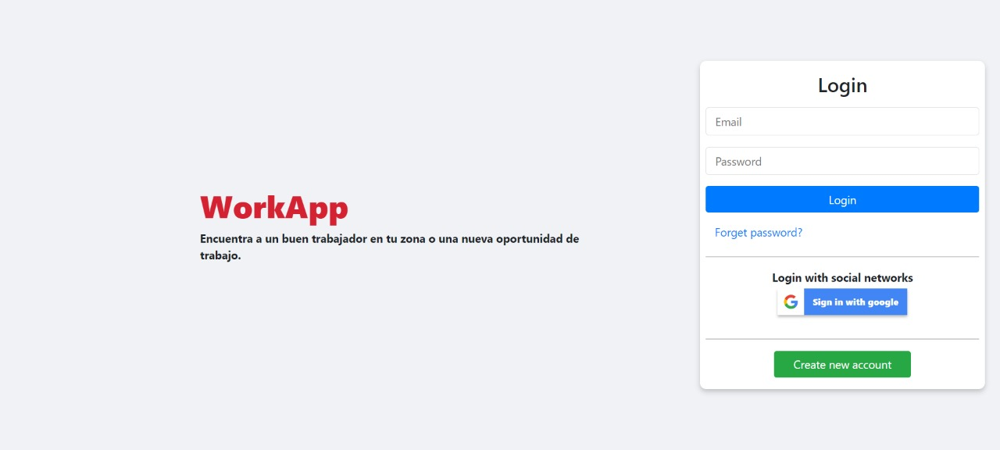
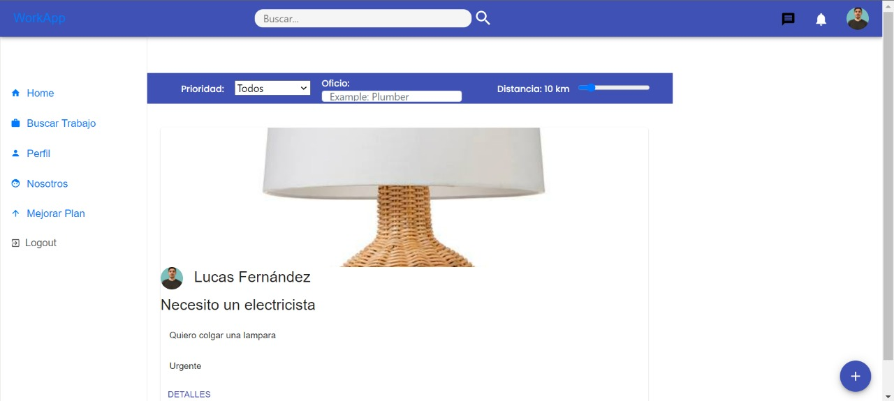
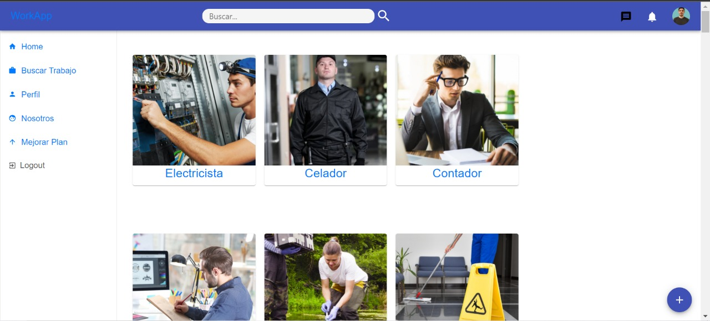
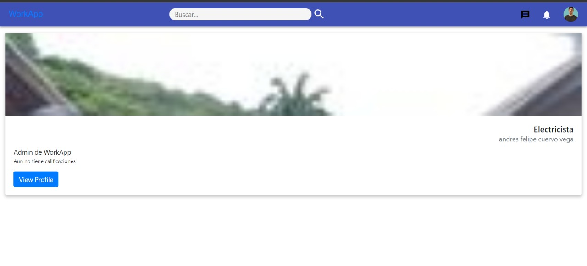
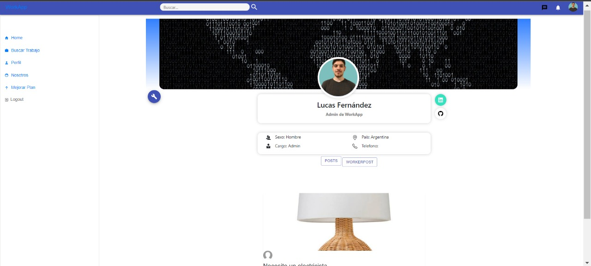
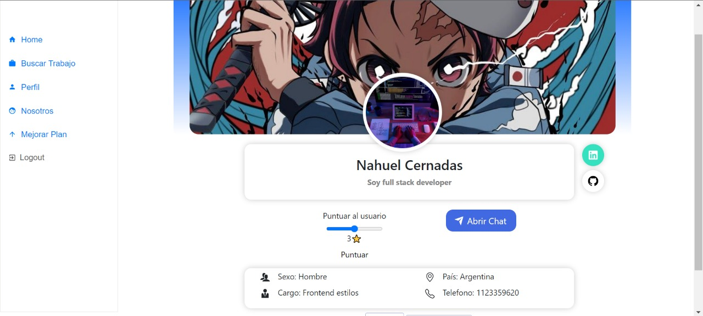
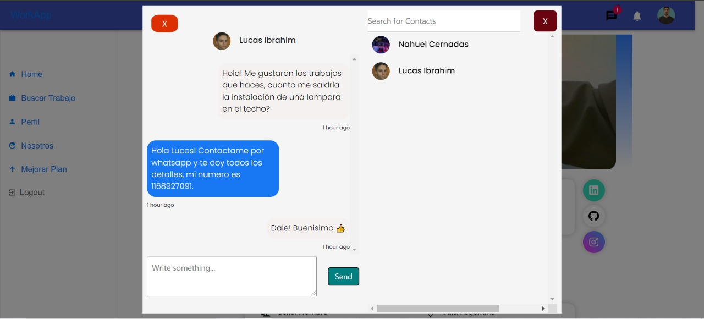
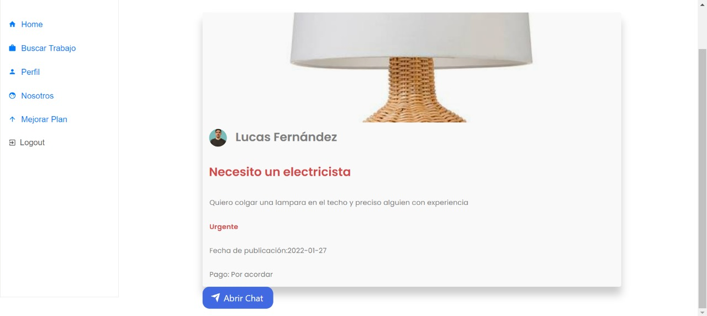

# WorkApp

Single Page Aplication que busca facilitar la búsqueda de trabajadores y el contacto entre trabajador y cliente. Un usuario puede buscar perfiles por el tipo de trabajo que requiere y pueden conversar los detalles de la contratación por el chat dentro de la app. Además los usuario que quieren ser contratados pueden subir lo que llamamos un "Workerpost", donde va a poder mostrar los detalles de su trabajo y asi aumentar la probabilidad de ser contratado. Además, si asi lo quisiese, el usuario puede contratar lo que llamamos "WorkApp Premium". Este plan le permite al usuario aumentar la visibilidad de su perfil y asi tambien aumentar la probabilidad de ser contratado.

## Caracteristicas

La información mostrada en la app proviene del backend que desarrollamos con `Node Js` y `Express` para levantar el servidor, y `PostgreSQL` junto con el ORM `Sequelize` para almacenar la información. En el backend desarrollamos todos los endpoints necesarios para realizar el CRUD de los registros y las relaciones entre ellos como también algunos filtro de registros a partir del nombre del empleo. Por ultimo, alli también se aloja la lógica de los chats y la pasarela de pago.

En cuanto al frontend utilizamos `React`, para el armado del `HTML`, `Redux` para los estados globales de la aplicación y `CSS` y `Material Ui` para los Estilos.  
En principio, en cuanto a la autenticación, utilizamos `Firebase`. Todas las rutas estan protegidas y solo se podran acceder si el usuario esta logeado.  
En cuanto a filtros la aplicación cuenta con un filtrado por ubicación, gracias a la api de `google maps`, por tipo de empleo, utilizando los endpoints del backend, y por tipo de urgencia.  
En cuanto a los post y workerpost se pueden editar y eliminar a gusto del usuario.  
Por ultimo tenemos los chat y las notificaciones donde incorporamos `Socket.io` para que esté a la escucha constantemente.

## Fotos

### Landing

### Home

### Buscar trabajo

### Perfiles del oficio que busco

### Mi perfil

### Perfil de otro usuario

### Chat

### Detalles de post

## Integrantes

- [Lucas Fernández](https://github.com/lucasfer01)

- [Mauricio Giana](https://github.com/MauricioGiana)

- [Andrés Felipe Cuervo](https://github.com/acuervov)

- [Lucas Ibrahim](https://github.com/Librahim99)

- [Jehison Gutierrez](https://github.com/jehison98)

- [Nahuel Cernadas](https://github.com/Nahuel-199)

